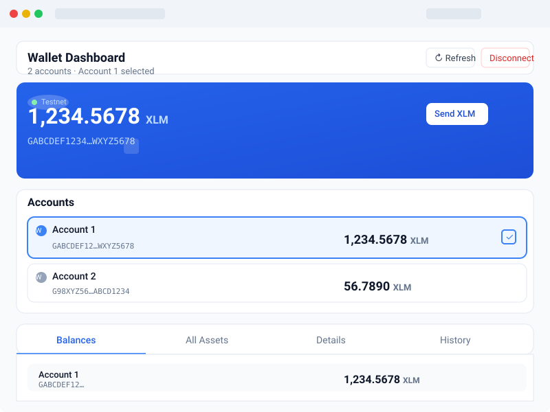
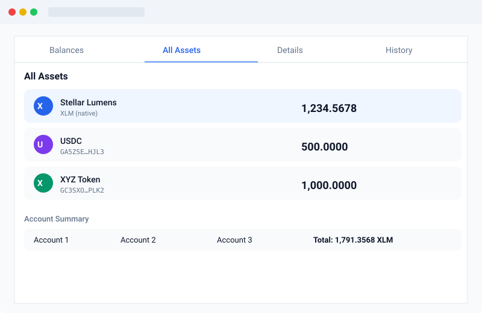
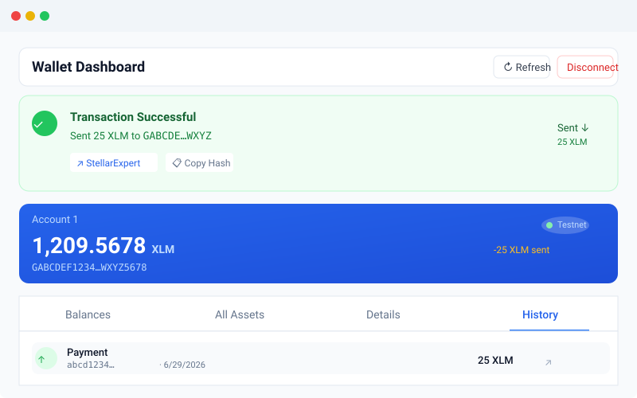

# Wallet Balance Checker

A Stellar wallet balance checker with Freighter integration. Connect your Freighter
wallet on Stellar Testnet to view XLM balances across multiple accounts, send
payments with real-time feedback, and explore account details on-chain.

## Screenshots

<table>
  <tr>
    <td align="center" width="33%">
      
      <br />
      <em>Wallet connected state &mdash; balance hero card</em>
    </td>
    <td align="center" width="33%">
      
      <br />
      <em>All asset balances &mdash; multi-account view</em>
    </td>
    <td align="center" width="33%">
      
      <br />
      <em>Successful testnet transaction &mdash; result feedback</em>
    </td>
  </tr>
</table>

### What you'll see

| Screenshot | Description |
|---|---|
| **Connected state** | Wallet is connected via Freighter on Testnet. The hero card shows the selected account's XLM balance, account label, and network badge. Use the Send XLM button to initiate a payment. |
| **Balances displayed** | The All Assets tab lists every asset held by the connected account (native XLM + issued tokens like USDC) with balances, asset codes, and issuer addresses. The account summary shows totals across all tracked accounts. |
| **Transaction result** | After sending XLM, a green success banner shows the amount and destination, with links to StellarExpert and a Copy Hash button. The hero balance updates immediately and the transaction appears in the History tab. |

## Features

- **Freighter Wallet** &mdash; Connect via Freighter browser extension (Stellar Testnet)
- **Multi-Account Balances** &mdash; Track any Stellar public key (add by key or from Freighter)
- **Send XLM** &mdash; Sign and submit payments through Freighter with real-time feedback
- **Transaction Feedback** &mdash; Success or failure state with transaction hash, amount, destination, and StellarExpert link
- **All Assets** &mdash; View native XLM and issued token balances
- **Account Details** &mdash; Sequence number, signers, thresholds, sub-entries
- **Transaction History** &mdash; Browse recent operations per account
- **Testnet Funding** &mdash; One-click Friendbot funding for new accounts

## Prerequisites

- [Freighter](https://freighter.app/) browser extension
- A Stellar wallet on **Testnet** network
- Node.js 18+

## Quick Start

```bash
npm install
npm run dev
```

Open [http://localhost:3000](http://localhost:3000) and click **Connect Freighter Wallet**.

### How to use

1. **Connect** &mdash; Click "Connect Freighter Wallet" and approve in the Freighter popup
2. **View balance** &mdash; Your XLM balance appears on the hero card; switch between accounts using the Accounts list
3. **Add accounts** &mdash; Click "+ Add Account" to enter a public key or add from Freighter
4. **Send XLM** &mdash; Click "Send XLM", enter destination and amount, sign with Freighter
5. **Check result** &mdash; A success/failure banner appears with transaction hash, amount, and explorer link
6. **Explore** &mdash; Use the tabs to view all assets, account details, and transaction history

## Scripts

| Command | Description |
|---|---|
| `npm run dev` | Start development server at http://localhost:3000 |
| `npm run build` | Type-check and production build |
| `npm run preview` | Preview production build |
| `npm run lint` | Run ESLint |

## Tech Stack

| Technology | Purpose |
|---|---|
| **React** | UI framework |
| **TypeScript** | Type safety (strict mode) |
| **Vite** | Build tool |
| **Tailwind CSS** | Styling |
| **@stellar/freighter-api** | Wallet connection & transaction signing |
| **@stellar/stellar-sdk** | Transaction building & XDR encoding |
| **Horizon API** | On-chain data queries (balances, transactions, account details) |

## Project Structure

```
src/
├── components/
│   └── WalletDashboard.tsx    # Full UI (no external icon libraries)
├── hooks/
│   └── useWallet.ts           # All wallet logic (230 lines)
├── App.tsx                    # Root component
├── main.tsx                   # Entry point
└── index.css                  # Tailwind imports
```

## How It Works

1. **Connection** &mdash; Uses `@stellar/freighter-api` to detect, connect, and request access from the Freighter browser extension
2. **Network** &mdash; Enforces Stellar Testnet; rejects connections on Mainnet/Futurenet
3. **Balances** &mdash; Fetches account data from Horizon REST API (`https://horizon-testnet.stellar.org`)
4. **Transactions** &mdash; Builds payment operations with `@stellar/stellar-sdk`'s `TransactionBuilder`, signs via Freighter, submits to Horizon
5. **Feedback** &mdash; Parses Horizon response for success/failure, displays hash, amount, destination, and explorer links

## License

MIT
